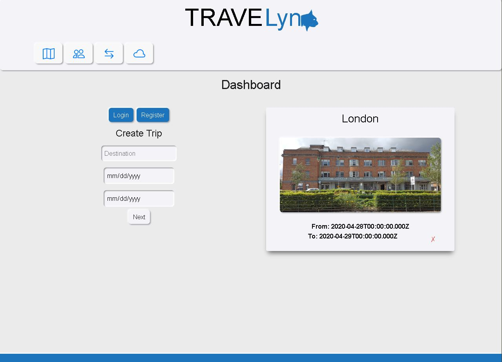

## Travelynx



Travelynx is an app for people to plan trips together. It helps to set up an itinerary and share it with friends or family. Our idea came from the stress of taking group trips trying to text everyone and get them on board with plans which is a hassle. This is where TRAVELynx comes into play letting a user or users compile lists of activities to do, set dates for travel, and have a comment thread to discuss the upcoming trip. We believe this makes it easier to plan a trip, and if a person does not want to download the app or participate, we have a private link to send users so they can view the page and get their trip details.

## Deployment

https://travelynx.herokuapp.com/

Start by installing front and backend dependencies. While in this directory, run the following command:

```
npm install
```

This should install node modules within the server and the client folder.

After both installations complete, run the following command in your terminal:

```
npm start
```

Your app should now be running on <http://localhost:3000>. The Express server should intercept any AJAX requests from the client.

## Built With

* Javascript / Axios
* [React](https://reactjs.org/)
* [Materialize CSS](https://materializecss.com/)

## Authors / Contributors

	cjmendez26  Janet Mendez
	LegenDeri619	Aidesiderio Alhambra
	philipipara	Philip Iparaguirre
	tomatomodest	tomatomodest
	twopheat	Brad Johnston

## License

This project is licensed under the MIT License
